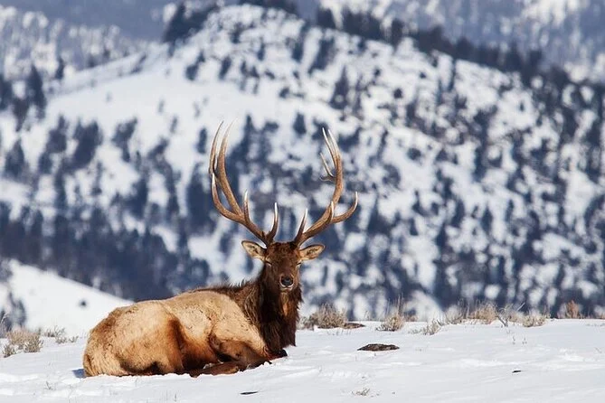

Load packages and set options.

```{r setup, include=FALSE}
library(tidyverse)
library(modelr)
library(leaflet)

knitr::opts_chunk$set(
  comment = '', fig.width = 8, fig.height = 6, out.width = "90%"
)

theme_set(theme_minimal() + theme(legend.position = "bottom"))

options(
  ggplot2.continuous.colour = "viridis",
  ggplot2.continuous.fill = "viridis"
)

scale_colour_discrete = scale_colour_viridis_d
scale_fill_discrete = scale_fill_viridis_d
```

Import elk migration data.

```{r}
elk_df = read_csv("../clean_data/elk.csv")

elk_df
```
The elk IDs are: `r unique(elk_df$elk_id)`, and we are going to follow them around Yellowstone! I found a cute picture of [here](https://powertraveller.com/yellowstone-winter-wildlife-safari-from-gardiner/)



## Exploratory Analysis of Elk Migration

Some questions we want to answer about the elk:

- Do the 17 elk move together as a pack or separately?
- Do the migration patterns change by year?
- Does time of year change the migration patterns?

Fun stuff I want to do
- Make a moving map of the elk

Let's plot where the elk are on the map!

```{r}
elk_df |>
  filter(year <= 2010) |>
  ggplot(aes(x = lat, y = long, color = year)) +
  geom_point(alpha = 0.3)

elk_df |>
  filter(year
  leaftlet() |>
  addProviderTiles(providers$CartoDB.Positron) |>
  addCircleMarkers(~lat, ~long, radius = 0.1, color = ~pal(elk_id)
```

