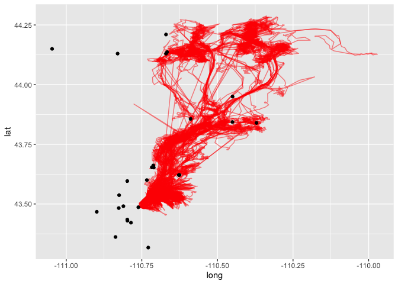

weather!
================
Dylan Morgan

Load packages.

``` r
library(tidyverse)
```

    ## ── Attaching core tidyverse packages ──────────────────────── tidyverse 2.0.0 ──
    ## ✔ dplyr     1.1.4     ✔ readr     2.1.5
    ## ✔ forcats   1.0.0     ✔ stringr   1.5.1
    ## ✔ ggplot2   3.5.1     ✔ tibble    3.2.1
    ## ✔ lubridate 1.9.3     ✔ tidyr     1.3.1
    ## ✔ purrr     1.0.2     
    ## ── Conflicts ────────────────────────────────────────── tidyverse_conflicts() ──
    ## ✖ dplyr::filter() masks stats::filter()
    ## ✖ dplyr::lag()    masks stats::lag()
    ## ℹ Use the conflicted package (<http://conflicted.r-lib.org/>) to force all conflicts to become errors

``` r
library(ggmap)
```

    ## ℹ Google's Terms of Service: <https://mapsplatform.google.com>
    ##   Stadia Maps' Terms of Service: <https://stadiamaps.com/terms-of-service/>
    ##   OpenStreetMap's Tile Usage Policy: <https://operations.osmfoundation.org/policies/tiles/>
    ## ℹ Please cite ggmap if you use it! Use `citation("ggmap")` for details.

Elk data from Wayne.

``` r
elk = read_csv("../DM_analysis/data/elk.csv")
```

    ## Rows: 104913 Columns: 7
    ## ── Column specification ────────────────────────────────────────────────────────
    ## Delimiter: ","
    ## dbl (7): elk_id, year, month, day, hour, lat, long
    ## 
    ## ℹ Use `spec()` to retrieve the full column specification for this data.
    ## ℹ Specify the column types or set `show_col_types = FALSE` to quiet this message.

Load and clean up weather data.

``` r
raw_weather <- read_csv("../DM_analysis/data/raw_weather_data.csv")
```

    ## Warning: One or more parsing issues, call `problems()` on your data frame for details,
    ## e.g.:
    ##   dat <- vroom(...)
    ##   problems(dat)

    ## Rows: 54745 Columns: 31
    ## ── Column specification ────────────────────────────────────────────────────────
    ## Delimiter: ","
    ## chr   (2): STATION, NAME
    ## dbl  (21): LATITUDE, LONGITUDE, ELEVATION, AWND, DAPR, MDPR, PRCP, SNOW, SNW...
    ## lgl   (7): MDSF, WT02, WT03, WT04, WT05, WT06, WT11
    ## date  (1): DATE
    ## 
    ## ℹ Use `spec()` to retrieve the full column specification for this data.
    ## ℹ Specify the column types or set `show_col_types = FALSE` to quiet this message.

Plot weather stations and elk migration pathways to determine which
stations to use.

``` r
weather_stations <-
  raw_weather |>
  group_by(NAME, LATITUDE, LONGITUDE) |>
  summarize(n_obs = n())
```

    ## `summarise()` has grouped output by 'NAME', 'LATITUDE'. You can override using
    ## the `.groups` argument.

``` r
ggplot() +
  geom_path(
    data = elk,
    aes(x=long, y=lat),
    alpha = 0.5,
    color = "red") +
  geom_point(data = weather_stations, aes(x = LONGITUDE, y = LATITUDE))
```

<!-- -->

``` r
ggplot(data = weather_stations,
         aes(x = LONGITUDE, y = LATITUDE)) +
  geom_point() +
  ggrepel::geom_label_repel(aes(label = NAME),
                            box.padding   = 0.35,
                            point.padding = 0.5,
                            segment.color = 'grey50',
                            max.overlaps = 20)
```

<!-- -->

``` r
potential_stations <- 
  c("LEWIS LAKE DIVIDE, WY US", "SNAKE RIVER, WY US", "SNAKE RIVER STATION, WY US", "BASE CAMP, WY US", 
    "MORAN 5 WNW, WY US", "JACKSON 29.9 NNE, WY US", "BURRO HILL WYOMING, WY US", "MOOSE 1 NNE, WY US", 
    "MOOSE, WY US", "MOOSE .4 S, WY US", "JACKSON 12.3 NE, WY US", "JACKSON 12.2 NE, WY US", 
    "JACKSON HOLE AIRPORT, WY US", "JACKSON, WY US")

four_stations <- 
  c("SNAKE RIVER STATION, WY US", "MORAN 5 WNW, WY US", "BURRO HILL WYOMING, WY US", "MOOSE 1 NNE, WY US")

reduced_weather_stations <- 
  raw_weather |> 
  filter(NAME %in% four_stations) |> 
  group_by(NAME, LATITUDE, LONGITUDE) |> 
  summarize(n_obs = n()) |> 
  arrange(desc(n_obs)) 
```

    ## `summarise()` has grouped output by 'NAME', 'LATITUDE'. You can override using
    ## the `.groups` argument.

``` r
four_stations_labels_plot <- 
  ggplot(data = reduced_weather_stations,
         aes(x = LONGITUDE, y = LATITUDE)) +
  geom_point() +
  ggrepel::geom_label_repel(aes(label = NAME),
                            box.padding   = 0.35,
                            point.padding = 0.5,
                            segment.color = 'grey50',
                            max.overlaps = 20)

four_stations_labels_plot
```

<!-- -->

``` r
ggsave(path = "../DM_analysis/plots/", 
       filename = "four_stations_labels_plot.png", 
       plot = four_stations_labels_plot)
```

    ## Saving 7 x 5 in image

``` r
four_stations_elk_mvmt_plot <- 
  ggplot() +
  geom_path(
    data = elk,
    aes(x=long, y=lat),
    alpha = 0.5,
    color = "red") +
  geom_point(data = reduced_weather_stations, aes(x = LONGITUDE, y = LATITUDE))
  
four_stations_elk_mvmt_plot
```

<!-- -->

``` r
ggsave(path = "../DM_analysis/plots/", 
       filename = "four_stations_elk_mvmt_plot.png", 
       plot = four_stations_elk_mvmt_plot)
```

    ## Saving 7 x 5 in image

Reduce weather station data, explore weather data.

``` r
reduced_weather <- 
  raw_weather |> 
  filter(NAME %in% four_stations)

reduced_weather |>
  group_by(NAME) |> 
  pivot_longer(
    TAVG:TMIN, 
    names_to = "temp_class", 
    values_to = "temp") |> 
  select(-c(WDF2:WT11)) |> 
  ggplot(aes(x = DATE, y = temp, color = temp_class)) + 
    geom_point()
```

    ## Warning: Removed 7062 rows containing missing values or values outside the scale range
    ## (`geom_point()`).

<!-- -->

Are there any differences in weather patterns observed among the
different stations that could have influenced elk movement patterns?

Take monthly avg/totals of temp, rainfall, and compare this data with
monthly elk movement pathways
