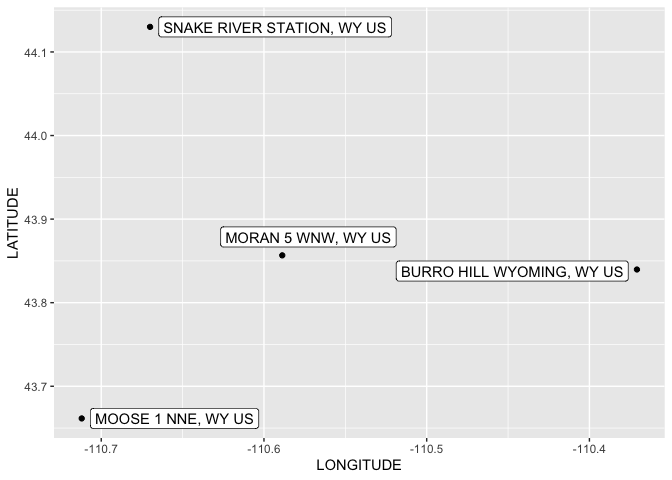
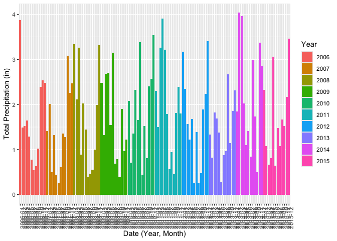
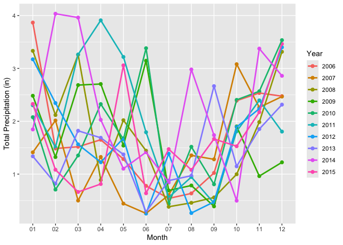
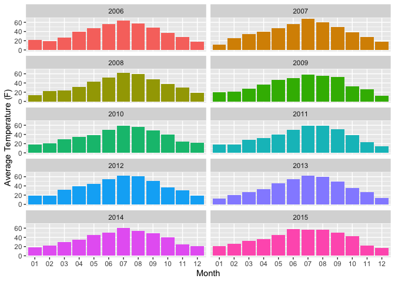
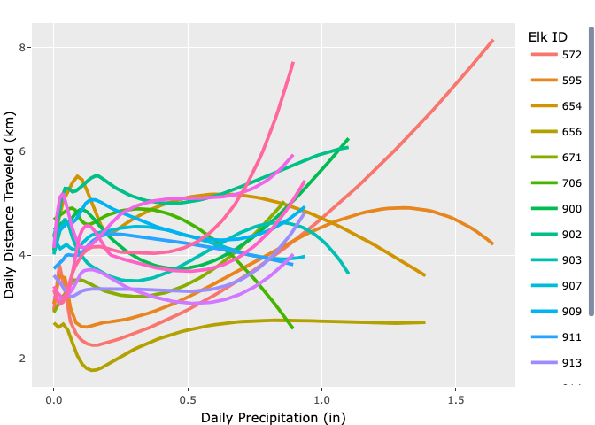
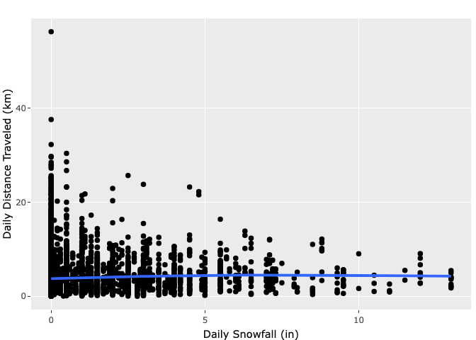

weather!
================
Dylan Morgan

Load packages.

``` r
library(tidyverse)
```

    ## ── Attaching core tidyverse packages ──────────────────────── tidyverse 2.0.0 ──
    ## ✔ dplyr     1.1.4     ✔ readr     2.1.5
    ## ✔ forcats   1.0.0     ✔ stringr   1.5.1
    ## ✔ ggplot2   3.5.1     ✔ tibble    3.2.1
    ## ✔ lubridate 1.9.3     ✔ tidyr     1.3.1
    ## ✔ purrr     1.0.2     
    ## ── Conflicts ────────────────────────────────────────── tidyverse_conflicts() ──
    ## ✖ dplyr::filter() masks stats::filter()
    ## ✖ dplyr::lag()    masks stats::lag()
    ## ℹ Use the conflicted package (<http://conflicted.r-lib.org/>) to force all conflicts to become errors

``` r
library(ggmap)
```

    ## ℹ Google's Terms of Service: <https://mapsplatform.google.com>
    ##   Stadia Maps' Terms of Service: <https://stadiamaps.com/terms-of-service/>
    ##   OpenStreetMap's Tile Usage Policy: <https://operations.osmfoundation.org/policies/tiles/>
    ## ℹ Please cite ggmap if you use it! Use `citation("ggmap")` for details.

``` r
library(geosphere)
library(lubridate)
```

Elk data from Wayne.

``` r
elk = read_csv("./data/elk.csv")
```

    ## Rows: 104913 Columns: 7
    ## ── Column specification ────────────────────────────────────────────────────────
    ## Delimiter: ","
    ## dbl (7): elk_id, year, month, day, hour, lat, long
    ## 
    ## ℹ Use `spec()` to retrieve the full column specification for this data.
    ## ℹ Specify the column types or set `show_col_types = FALSE` to quiet this message.

Load and clean up weather data.

``` r
raw_weather <- read_csv("./data/raw_weather_data.csv")
```

    ## Warning: One or more parsing issues, call `problems()` on your data frame for details,
    ## e.g.:
    ##   dat <- vroom(...)
    ##   problems(dat)

    ## Rows: 54745 Columns: 31
    ## ── Column specification ────────────────────────────────────────────────────────
    ## Delimiter: ","
    ## chr   (2): STATION, NAME
    ## dbl  (21): LATITUDE, LONGITUDE, ELEVATION, AWND, DAPR, MDPR, PRCP, SNOW, SNW...
    ## lgl   (7): MDSF, WT02, WT03, WT04, WT05, WT06, WT11
    ## date  (1): DATE
    ## 
    ## ℹ Use `spec()` to retrieve the full column specification for this data.
    ## ℹ Specify the column types or set `show_col_types = FALSE` to quiet this message.

Plot weather stations and elk migration pathways to determine which
stations to use.

``` r
weather_stations <-
  raw_weather |>
  group_by(NAME, LATITUDE, LONGITUDE) |>
  summarize(n_obs = n())
```

    ## `summarise()` has grouped output by 'NAME', 'LATITUDE'. You can override using
    ## the `.groups` argument.

``` r
ggplot() +
  geom_path(
    data = elk,
    aes(x=long, y=lat),
    alpha = 0.5,
    color = "red") +
  geom_point(data = weather_stations, aes(x = LONGITUDE, y = LATITUDE))
```

<!-- -->

``` r
ggplot(data = weather_stations,
         aes(x = LONGITUDE, y = LATITUDE)) +
  geom_point() +
  ggrepel::geom_label_repel(aes(label = NAME),
                            box.padding   = 0.35,
                            point.padding = 0.5,
                            segment.color = 'grey50',
                            max.overlaps = 20)
```

<!-- -->

``` r
potential_stations <- 
  c("LEWIS LAKE DIVIDE, WY US", "SNAKE RIVER, WY US", "SNAKE RIVER STATION, WY US", "BASE CAMP, WY US", 
    "MORAN 5 WNW, WY US", "JACKSON 29.9 NNE, WY US", "BURRO HILL WYOMING, WY US", "MOOSE 1 NNE, WY US", 
    "MOOSE, WY US", "MOOSE .4 S, WY US", "JACKSON 12.3 NE, WY US", "JACKSON 12.2 NE, WY US", 
    "JACKSON HOLE AIRPORT, WY US", "JACKSON, WY US")

four_stations <- 
  c("SNAKE RIVER STATION, WY US", "MORAN 5 WNW, WY US", "BURRO HILL WYOMING, WY US", "MOOSE 1 NNE, WY US")

reduced_weather_stations <- 
  raw_weather |> 
  filter(NAME %in% four_stations) |> 
  group_by(NAME, LATITUDE, LONGITUDE) |> 
  summarize(n_obs = n()) |> 
  arrange(desc(n_obs)) 
```

    ## `summarise()` has grouped output by 'NAME', 'LATITUDE'. You can override using
    ## the `.groups` argument.

``` r
four_stations_labels_plot <- 
  ggplot(data = reduced_weather_stations,
         aes(x = LONGITUDE, y = LATITUDE)) +
  geom_point() +
  ggrepel::geom_label_repel(aes(label = NAME),
                            box.padding   = 0.35,
                            point.padding = 0.5,
                            segment.color = 'grey50',
                            max.overlaps = 20)

four_stations_labels_plot
```

<!-- -->

``` r
ggsave(path = "./plots/", 
       filename = "four_stations_labels_plot.png", 
       plot = four_stations_labels_plot)
```

    ## Saving 7 x 5 in image

``` r
four_stations_elk_mvmt_plot <- 
  ggplot() +
  geom_path(
    data = elk,
    aes(x=long, y=lat),
    alpha = 0.5,
    color = "red") +
  geom_point(data = reduced_weather_stations, aes(x = LONGITUDE, y = LATITUDE))
  
four_stations_elk_mvmt_plot
```

<!-- -->

``` r
ggsave(path = "./plots/", 
       filename = "four_stations_elk_mvmt_plot.png", 
       plot = four_stations_elk_mvmt_plot)
```

    ## Saving 7 x 5 in image

Reduce weather station data, explore weather data.

``` r
reduced_weather <- 
  raw_weather |> 
  filter(NAME %in% four_stations)

# reduced_weather |>
#   group_by(NAME) |> 
#   pivot_longer(
#     TAVG:TMIN, 
#     names_to = "temp_class", 
#     values_to = "temp") |> 
#   select(-c(WDF2:WT11)) |> 
#   ggplot(aes(x = DATE, y = temp, color = temp_class)) + 
#     geom_point() + 
#   facet_grid(~factor(NAME))
```

Are there any differences in weather patterns observed among the
different stations that could have influenced elk movement patterns?

What kinds of monthly weather patterns were visible over this time
period?

Were there any extreme weather events that occurred?

Find patterns in temp, rainfall, snowfall over time. Factor by month.
Avg rainfall total, snowfall total, snow depth total, temp avg.

*Histogram or barchart?*

Histogram of total precip Histogram of precip by year Histogram of
precip by month Compared to histogram of elk movement by month Histogram
of total snowfall Histogram of snowfall by year Histogram of snowfall by
month Compared to Histogram of Elk movement by month Histogram of daily
temperatures by year Histogram of daily temperatures by month
Scatterplot of daily elk movement versus snowfall Scatterplot of daily
elk movement versus snowdepth Scatterplot of daily elk movement versus
temperature

Total precip – avg totals among the four stations. Three ways to show
data: faceted bar chart per year, point + line graph per year,
year-month bar chart separated by year

``` r
# faceted bar chart, separated by month and year
reduced_weather |> 
  select(c(STATION, NAME, LATITUDE, LONGITUDE, DATE, PRCP, SNOW, SNWD, TAVG)) |> 
  mutate(year = format(DATE, "%Y"), 
         month = format(DATE, "%m")) |> 
  group_by(NAME, year, month) |> 
  summarize(station_precip_total = sum(PRCP, na.rm = TRUE)) |> 
  group_by(year, month) |> 
  summarize(station_precip_total_avg = mean(station_precip_total, na.rm = TRUE)) |> 
  mutate(year_month = paste(year, month, sep = "-")) |> 
  ggplot(aes(x = month, y = station_precip_total_avg, fill = as.factor(year))) +
  geom_bar(stat = "identity") + 
  facet_wrap(vars(year), ncol = 2) + 
  theme(legend.position = "none")
```

    ## `summarise()` has grouped output by 'NAME', 'year'. You can override using the
    ## `.groups` argument.
    ## `summarise()` has grouped output by 'year'. You can override using the
    ## `.groups` argument.

<!-- -->

``` r
# point + line, separated by month and year
reduced_weather |> 
  select(c(STATION, NAME, LATITUDE, LONGITUDE, DATE, PRCP, SNOW, SNWD, TAVG)) |> 
  mutate(year = format(DATE, "%Y"), 
         month = format(DATE, "%m")) |> 
  group_by(NAME, year, month) |> 
  summarize(station_precip_total = sum(PRCP, na.rm = TRUE)) |> 
  group_by(year, month) |> 
  summarize(station_precip_total_avg = mean(station_precip_total, na.rm = TRUE)) |> 
  mutate(year_month = paste(year, month, sep = "-")) |> 
  ggplot(aes(x = month, y = station_precip_total_avg, color = year, group = year)) + 
  geom_point(size = 2) + 
  geom_line(linewidth = 1)
```

    ## `summarise()` has grouped output by 'NAME', 'year'. You can override using the
    ## `.groups` argument.
    ## `summarise()` has grouped output by 'year'. You can override using the
    ## `.groups` argument.

<!-- -->

``` r
# year-month totals, separated by year
reduced_weather |> 
  select(c(STATION, NAME, LATITUDE, LONGITUDE, DATE, PRCP, SNOW, SNWD, TAVG)) |> 
  mutate(year = format(DATE, "%Y"), 
         month = format(DATE, "%m")) |> 
  group_by(NAME, year, month) |> 
  summarize(station_precip_total = sum(PRCP, na.rm = TRUE)) |> 
  group_by(year, month) |> 
  summarize(station_precip_total_avg = mean(station_precip_total, na.rm = TRUE)) |> 
  mutate(year_month = paste(year, month, sep = "-")) |> 
  ggplot(aes(x = year_month, y = station_precip_total_avg, fill = as.factor(year))) +
  geom_bar(stat = "identity") + 
  theme(axis.text.x = element_text(angle = 90, hjust = 1))
```

    ## `summarise()` has grouped output by 'NAME', 'year'. You can override using the
    ## `.groups` argument.
    ## `summarise()` has grouped output by 'year'. You can override using the
    ## `.groups` argument.

<!-- -->

Do the same for snowfall.

``` r
# faceted bar chart, separated by month and year
reduced_weather |> 
  select(c(STATION, NAME, LATITUDE, LONGITUDE, DATE, PRCP, SNOW, SNWD, TAVG)) |> 
  mutate(year = format(DATE, "%Y"), 
         month = format(DATE, "%m")) |> 
  group_by(NAME, year, month) |> 
  summarize(station_snowfall_total = sum(SNOW, na.rm = TRUE)) |> 
  group_by(year, month) |> 
  summarize(station_snowfall_total_avg = mean(station_snowfall_total, na.rm = TRUE)) |> 
  mutate(year_month = paste(year, month, sep = "-")) |> 
  ggplot(aes(x = month, y = station_snowfall_total_avg, fill = as.factor(year))) +
  geom_bar(stat = "identity") + 
  facet_wrap(vars(year), ncol = 2) + 
  theme(legend.position = "none")
```

    ## `summarise()` has grouped output by 'NAME', 'year'. You can override using the
    ## `.groups` argument.
    ## `summarise()` has grouped output by 'year'. You can override using the
    ## `.groups` argument.

<!-- -->

``` r
# point + line
reduced_weather |> 
  select(c(STATION, NAME, LATITUDE, LONGITUDE, DATE, PRCP, SNOW, SNWD, TAVG)) |> 
  mutate(year = format(DATE, "%Y"), 
         month = format(DATE, "%m")) |> 
  group_by(NAME, year, month) |> 
  summarize(station_snowfall_total = sum(SNOW, na.rm = TRUE)) |> 
  group_by(year, month) |> 
  summarize(station_snowfall_total_avg = mean(station_snowfall_total, na.rm = TRUE)) |> 
  mutate(year_month = paste(year, month, sep = "-")) |> 
  ggplot(aes(x = month, y = station_snowfall_total_avg, color = year, group = year)) + 
  geom_point(size = 2) + 
  geom_line(linewidth = 1)
```

    ## `summarise()` has grouped output by 'NAME', 'year'. You can override using the
    ## `.groups` argument.
    ## `summarise()` has grouped output by 'year'. You can override using the
    ## `.groups` argument.

<!-- -->

``` r
# year-month totals by year
reduced_weather |> 
  select(c(STATION, NAME, LATITUDE, LONGITUDE, DATE, PRCP, SNOW, SNWD, TAVG)) |> 
  mutate(year = format(DATE, "%Y"), 
         month = format(DATE, "%m")) |> 
  group_by(NAME, year, month) |> 
  summarize(station_snowfall_total = sum(SNOW, na.rm = TRUE)) |> 
  group_by(year, month) |> 
  summarize(station_snowfall_total_avg = mean(station_snowfall_total, na.rm = TRUE)) |> 
  mutate(year_month = paste(year, month, sep = "-")) |> 
  ggplot(aes(x = year_month, y = station_snowfall_total_avg, fill = as.factor(year))) + 
  geom_bar(stat = "identity") + 
  theme(axis.text.x = element_text(angle = 90, hjust = 1))
```

    ## `summarise()` has grouped output by 'NAME', 'year'. You can override using the
    ## `.groups` argument.
    ## `summarise()` has grouped output by 'year'. You can override using the
    ## `.groups` argument.

<!-- -->

Snow depth.

``` r
# faceted bar chart, separated by month and year
reduced_weather |> 
  select(c(STATION, NAME, LATITUDE, LONGITUDE, DATE, PRCP, SNOW, SNWD, TAVG)) |> 
  mutate(year = format(DATE, "%Y"), 
         month = format(DATE, "%m")) |> 
  group_by(NAME, year, month) |> 
  summarize(station_snowdepth_total = sum(SNWD, na.rm = TRUE)) |> 
  group_by(year, month) |> 
  summarize(station_snowdepth_total_avg = mean(station_snowdepth_total, na.rm = TRUE)) |> 
  mutate(year_month = paste(year, month, sep = "-")) |> 
  ggplot(aes(x = month, y = station_snowdepth_total_avg, fill = as.factor(year))) +
  geom_bar(stat = "identity") + 
  facet_wrap(vars(year), ncol = 2) + 
  theme(legend.position = "none")
```

    ## `summarise()` has grouped output by 'NAME', 'year'. You can override using the
    ## `.groups` argument.
    ## `summarise()` has grouped output by 'year'. You can override using the
    ## `.groups` argument.

<!-- -->

``` r
# point + line
reduced_weather |> 
  select(c(STATION, NAME, LATITUDE, LONGITUDE, DATE, PRCP, SNOW, SNWD, TAVG)) |> 
  mutate(year = format(DATE, "%Y"), 
         month = format(DATE, "%m")) |> 
  group_by(NAME, year, month) |> 
  summarize(station_snowdepth_total = sum(SNWD, na.rm = TRUE)) |> 
  group_by(year, month) |> 
  summarize(station_snowdepth_total_avg = mean(station_snowdepth_total, na.rm = TRUE)) |> 
  mutate(year_month = paste(year, month, sep = "-")) |> 
  ggplot(aes(x = month, y = station_snowdepth_total_avg, color = year, group = year)) + 
  geom_point(size = 2) + 
  geom_line(linewidth = 1)
```

    ## `summarise()` has grouped output by 'NAME', 'year'. You can override using the
    ## `.groups` argument.
    ## `summarise()` has grouped output by 'year'. You can override using the
    ## `.groups` argument.

<!-- -->

``` r
# year-month totals
reduced_weather |> 
  select(c(STATION, NAME, LATITUDE, LONGITUDE, DATE, PRCP, SNOW, SNWD, TAVG)) |> 
  mutate(year = format(DATE, "%Y"), 
         month = format(DATE, "%m")) |> 
  group_by(NAME, year, month) |> 
  summarize(station_snowdepth_total = sum(SNWD, na.rm = TRUE)) |> 
  group_by(year, month) |> 
  summarize(station_snowdepth_total_avg = mean(station_snowdepth_total, na.rm = TRUE)) |> 
  mutate(year_month = paste(year, month, sep = "-")) |> 
  ggplot(aes(x = year_month, y = station_snowdepth_total_avg, fill = as.factor(year))) + 
  geom_bar(stat = "identity") + 
  theme(axis.text.x = element_text(angle = 90, hjust = 1))
```

    ## `summarise()` has grouped output by 'NAME', 'year'. You can override using the
    ## `.groups` argument.
    ## `summarise()` has grouped output by 'year'. You can override using the
    ## `.groups` argument.

<!-- -->

Scatterplot of daily elk movement versus precip Scatterplot of daily elk
movement versus snowfall Scatterplot of daily elk movement versus snow
depth Scatterplot of daily elk movement versus temperature

all data df.

``` r
all_data <- read_csv("./data/all_data.csv")
```

    ## Rows: 104913 Columns: 16
    ## ── Column specification ────────────────────────────────────────────────────────
    ## Delimiter: ","
    ## dbl  (15): elk_id, year, month, day, hour, lat, long, dist_km, land_cover, t...
    ## dttm  (1): dt
    ## 
    ## ℹ Use `spec()` to retrieve the full column specification for this data.
    ## ℹ Specify the column types or set `show_col_types = FALSE` to quiet this message.

Scatterplot of daily elk movement versus precip.

``` r
all_data |> 
  ggplot(aes(x = dt, y = dist_km, color = year, group = year)) + 
  geom_point()
```

    ## Warning: Removed 17 rows containing missing values or values outside the scale range
    ## (`geom_point()`).

<!-- -->

Land cover.

``` r
daily_elk =
  all_data |>
  group_by(
    elk_id,
    year,
    month,
    day,
    tavg,
    prcp,
    snow,
    snwd
  ) |>
  summarize(
    dist_km = sum(dist_km, na.rm = TRUE), 
    land_cover = mean(land_cover, na.rm = TRUE)
  )
```

    ## `summarise()` has grouped output by 'elk_id', 'year', 'month', 'day', 'tavg',
    ## 'prcp', 'snow'. You can override using the `.groups` argument.

``` r
daily_elk |> 
  ggplot(aes(x = land_cover)) + 
  geom_histogram()
```

    ## `stat_bin()` using `bins = 30`. Pick better value with `binwidth`.

<!-- -->

Elk mvmt vs precip.

``` r
daily_elk |> 
  ggplot(aes(x = prcp, y = dist_km)) + 
  geom_point() + 
  geom_smooth(se = FALSE)
```

    ## `geom_smooth()` using method = 'gam' and formula = 'y ~ s(x, bs = "cs")'

    ## Warning: Removed 143 rows containing non-finite outside the scale range
    ## (`stat_smooth()`).

    ## Warning: Removed 143 rows containing missing values or values outside the scale range
    ## (`geom_point()`).

<!-- -->

``` r
daily_elk |> 
  ggplot(aes(x = prcp, y = dist_km, color = as.factor(year))) + 
  geom_point() + 
  geom_smooth(se = FALSE)
```

    ## `geom_smooth()` using method = 'gam' and formula = 'y ~ s(x, bs = "cs")'

    ## Warning: Removed 143 rows containing non-finite outside the scale range
    ## (`stat_smooth()`).
    ## Removed 143 rows containing missing values or values outside the scale range
    ## (`geom_point()`).

<!-- -->

``` r
daily_elk |> 
  ggplot(aes(x = prcp, y = dist_km)) + 
  geom_hex() + 
  geom_smooth(se = FALSE)
```

    ## Warning: Removed 143 rows containing non-finite outside the scale range
    ## (`stat_binhex()`).

    ## `geom_smooth()` using method = 'gam' and formula = 'y ~ s(x, bs = "cs")'

    ## Warning: Removed 143 rows containing non-finite outside the scale range
    ## (`stat_smooth()`).

<!-- -->

``` r
daily_elk |> 
  ggplot(aes(x = prcp, y = dist_km)) + 
  geom_hex() + 
  geom_smooth(se = FALSE) + 
  facet_wrap(vars(year), ncol = 5)
```

    ## Warning: Removed 143 rows containing non-finite outside the scale range
    ## (`stat_binhex()`).

    ## `geom_smooth()` using method = 'gam' and formula = 'y ~ s(x, bs = "cs")'

    ## Warning: Removed 143 rows containing non-finite outside the scale range
    ## (`stat_smooth()`).

<!-- -->

Elk mvmt vs. snowfall.

``` r
daily_elk |> 
  ggplot(aes(x = snow, y = dist_km)) + 
  geom_point() + 
  geom_smooth(se = FALSE)
```

    ## `geom_smooth()` using method = 'gam' and formula = 'y ~ s(x, bs = "cs")'

    ## Warning: Removed 1274 rows containing non-finite outside the scale range
    ## (`stat_smooth()`).

    ## Warning: Removed 1274 rows containing missing values or values outside the scale range
    ## (`geom_point()`).

<!-- -->

``` r
daily_elk |> 
  ggplot(aes(x = snow, y = dist_km, color = as.factor(year))) + 
  geom_point() + 
  geom_smooth(se = FALSE)
```

    ## `geom_smooth()` using method = 'gam' and formula = 'y ~ s(x, bs = "cs")'

    ## Warning: Removed 1274 rows containing non-finite outside the scale range
    ## (`stat_smooth()`).
    ## Removed 1274 rows containing missing values or values outside the scale range
    ## (`geom_point()`).

<!-- -->

``` r
daily_elk |> 
  ggplot(aes(x = snow, y = dist_km)) + 
  geom_hex() + 
  geom_smooth(se = FALSE)
```

    ## Warning: Removed 1274 rows containing non-finite outside the scale range
    ## (`stat_binhex()`).

    ## `geom_smooth()` using method = 'gam' and formula = 'y ~ s(x, bs = "cs")'

    ## Warning: Removed 1274 rows containing non-finite outside the scale range
    ## (`stat_smooth()`).

<!-- -->

``` r
daily_elk |> 
  ggplot(aes(x = snow, y = dist_km)) + 
  geom_hex() + 
  geom_smooth(se = FALSE) + 
  facet_wrap(vars(year), ncol = 5)
```

    ## Warning: Removed 1274 rows containing non-finite outside the scale range
    ## (`stat_binhex()`).

    ## `geom_smooth()` using method = 'gam' and formula = 'y ~ s(x, bs = "cs")'

    ## Warning: Removed 1274 rows containing non-finite outside the scale range
    ## (`stat_smooth()`).

<!-- -->
