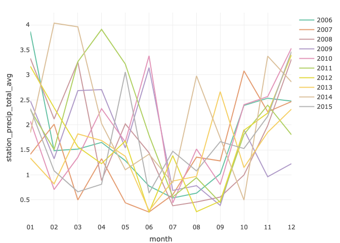
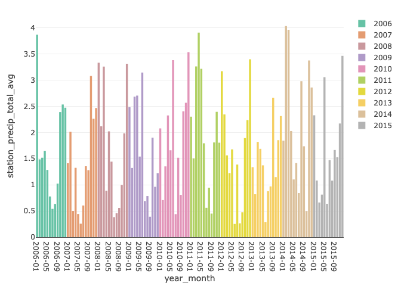

weather and it’s the same but it’s all metric and plotly so it’s not
================
Dylan Morgan

Load packages.

``` r
library(tidyverse)
```

    ## ── Attaching core tidyverse packages ──────────────────────── tidyverse 2.0.0 ──
    ## ✔ dplyr     1.1.4     ✔ readr     2.1.5
    ## ✔ forcats   1.0.0     ✔ stringr   1.5.1
    ## ✔ ggplot2   3.5.1     ✔ tibble    3.2.1
    ## ✔ lubridate 1.9.3     ✔ tidyr     1.3.1
    ## ✔ purrr     1.0.2     
    ## ── Conflicts ────────────────────────────────────────── tidyverse_conflicts() ──
    ## ✖ dplyr::filter() masks stats::filter()
    ## ✖ dplyr::lag()    masks stats::lag()
    ## ℹ Use the conflicted package (<http://conflicted.r-lib.org/>) to force all conflicts to become errors

``` r
library(ggmap)
```

    ## ℹ Google's Terms of Service: <https://mapsplatform.google.com>
    ##   Stadia Maps' Terms of Service: <https://stadiamaps.com/terms-of-service/>
    ##   OpenStreetMap's Tile Usage Policy: <https://operations.osmfoundation.org/policies/tiles/>
    ## ℹ Please cite ggmap if you use it! Use `citation("ggmap")` for details.

``` r
library(geosphere)
library(lubridate)
library(plotly)
```

    ## 
    ## Attaching package: 'plotly'
    ## 
    ## The following object is masked from 'package:ggmap':
    ## 
    ##     wind
    ## 
    ## The following object is masked from 'package:ggplot2':
    ## 
    ##     last_plot
    ## 
    ## The following object is masked from 'package:stats':
    ## 
    ##     filter
    ## 
    ## The following object is masked from 'package:graphics':
    ## 
    ##     layout

Load data.

``` r
elk = read_csv("./data/elk.csv")
```

    ## Rows: 104913 Columns: 7
    ## ── Column specification ────────────────────────────────────────────────────────
    ## Delimiter: ","
    ## dbl (7): elk_id, year, month, day, hour, lat, long
    ## 
    ## ℹ Use `spec()` to retrieve the full column specification for this data.
    ## ℹ Specify the column types or set `show_col_types = FALSE` to quiet this message.

``` r
raw_weather <- read_csv("./data/raw_weather_data.csv")
```

    ## Warning: One or more parsing issues, call `problems()` on your data frame for details,
    ## e.g.:
    ##   dat <- vroom(...)
    ##   problems(dat)

    ## Rows: 54745 Columns: 31
    ## ── Column specification ────────────────────────────────────────────────────────
    ## Delimiter: ","
    ## chr   (2): STATION, NAME
    ## dbl  (21): LATITUDE, LONGITUDE, ELEVATION, AWND, DAPR, MDPR, PRCP, SNOW, SNW...
    ## lgl   (7): MDSF, WT02, WT03, WT04, WT05, WT06, WT11
    ## date  (1): DATE
    ## 
    ## ℹ Use `spec()` to retrieve the full column specification for this data.
    ## ℹ Specify the column types or set `show_col_types = FALSE` to quiet this message.

``` r
weather_stations <-
  raw_weather |>
  group_by(NAME, LATITUDE, LONGITUDE) |>
  summarize(n_obs = n())
```

    ## `summarise()` has grouped output by 'NAME', 'LATITUDE'. You can override using
    ## the `.groups` argument.

``` r
potential_stations <- 
  c("LEWIS LAKE DIVIDE, WY US", "SNAKE RIVER, WY US", "SNAKE RIVER STATION, WY US", "BASE CAMP, WY US", 
    "MORAN 5 WNW, WY US", "JACKSON 29.9 NNE, WY US", "BURRO HILL WYOMING, WY US", "MOOSE 1 NNE, WY US", 
    "MOOSE, WY US", "MOOSE .4 S, WY US", "JACKSON 12.3 NE, WY US", "JACKSON 12.2 NE, WY US", 
    "JACKSON HOLE AIRPORT, WY US", "JACKSON, WY US")

four_stations <- 
  c("SNAKE RIVER STATION, WY US", "MORAN 5 WNW, WY US", "BURRO HILL WYOMING, WY US", "MOOSE 1 NNE, WY US")

reduced_weather_stations <- 
  raw_weather |> 
  filter(NAME %in% four_stations) |> 
  group_by(NAME, LATITUDE, LONGITUDE) |> 
  summarize(n_obs = n()) |> 
  arrange(desc(n_obs))
```

    ## `summarise()` has grouped output by 'NAME', 'LATITUDE'. You can override using
    ## the `.groups` argument.

``` r
reduced_weather <- 
  raw_weather |> 
  filter(NAME %in% four_stations)

all_data <- read_csv("./data/all_data.csv")
```

    ## Rows: 104913 Columns: 16
    ## ── Column specification ────────────────────────────────────────────────────────
    ## Delimiter: ","
    ## dbl  (15): elk_id, year, month, day, hour, lat, long, dist_km, land_cover, t...
    ## dttm  (1): dt
    ## 
    ## ℹ Use `spec()` to retrieve the full column specification for this data.
    ## ℹ Specify the column types or set `show_col_types = FALSE` to quiet this message.

``` r
daily_elk =
  all_data |>
  group_by(
    elk_id,
    year,
    month,
    day,
    tavg,
    prcp,
    snow,
    snwd
  ) |>
  summarize(
    dist_km = sum(dist_km, na.rm = TRUE), 
    land_cover = mean(land_cover, na.rm = TRUE)
  )
```

    ## `summarise()` has grouped output by 'elk_id', 'year', 'month', 'day', 'tavg',
    ## 'prcp', 'snow'. You can override using the `.groups` argument.

Precip plotly.

``` r
# point + line, separated by month and year
reduced_weather |> 
  select(c(STATION, NAME, LATITUDE, LONGITUDE, DATE, PRCP, SNOW, SNWD, TAVG)) |> 
  mutate(year = format(DATE, "%Y"), 
         month = format(DATE, "%m")) |> 
  group_by(NAME, year, month) |> 
  summarize(station_precip_total = sum(PRCP, na.rm = TRUE)) |> 
  group_by(year, month) |> 
  summarize(station_precip_total_avg = mean(station_precip_total, na.rm = TRUE)) |> 
  mutate(year_month = paste(year, month, sep = "-")) |> 
  plot_ly(
    x = ~month, y = ~station_precip_total_avg, color = ~year, group = ~year, type = 'scatter', mode = 'lines'
    )
```

    ## `summarise()` has grouped output by 'NAME', 'year'. You can override using the
    ## `.groups` argument.
    ## `summarise()` has grouped output by 'year'. You can override using the
    ## `.groups` argument.

    ## Warning in plot_ly(mutate(summarize(group_by(summarize(group_by(mutate(select(reduced_weather, : The group argument has been deprecated. Use `group_by()` or split instead.
    ## See `help('plotly_data')` for examples

    ## Warning in RColorBrewer::brewer.pal(N, "Set2"): n too large, allowed maximum for palette Set2 is 8
    ## Returning the palette you asked for with that many colors
    ## Warning in RColorBrewer::brewer.pal(N, "Set2"): n too large, allowed maximum for palette Set2 is 8
    ## Returning the palette you asked for with that many colors

<!-- -->

``` r
# year-month totals, separated by year
reduced_weather |> 
  select(c(STATION, NAME, LATITUDE, LONGITUDE, DATE, PRCP, SNOW, SNWD, TAVG)) |> 
  mutate(year = format(DATE, "%Y"), 
         month = format(DATE, "%m")) |> 
  group_by(NAME, year, month) |> 
  summarize(station_precip_total = sum(PRCP, na.rm = TRUE)) |> 
  group_by(year, month) |> 
  summarize(station_precip_total_avg = mean(station_precip_total, na.rm = TRUE)) |> 
  mutate(year_month = paste(year, month, sep = "-")) |> 
  plot_ly(
    x = ~year_month, y = ~station_precip_total_avg, color = ~as.factor(year), type = "bar"
    )
```

    ## `summarise()` has grouped output by 'NAME', 'year'. You can override using the
    ## `.groups` argument.
    ## `summarise()` has grouped output by 'year'. You can override using the
    ## `.groups` argument.

    ## Warning in RColorBrewer::brewer.pal(N, "Set2"): n too large, allowed maximum for palette Set2 is 8
    ## Returning the palette you asked for with that many colors
    ## Warning in RColorBrewer::brewer.pal(N, "Set2"): n too large, allowed maximum for palette Set2 is 8
    ## Returning the palette you asked for with that many colors

<!-- -->
