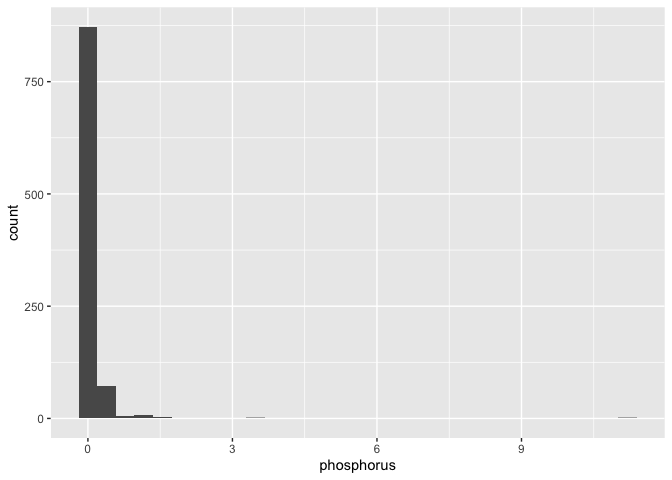

TP_analysis
================

## Load Packages

``` r
library(tidyverse)
```

    ## ── Attaching core tidyverse packages ──────────────────────── tidyverse 2.0.0 ──
    ## ✔ dplyr     1.1.4     ✔ readr     2.1.5
    ## ✔ forcats   1.0.0     ✔ stringr   1.5.1
    ## ✔ ggplot2   3.5.1     ✔ tibble    3.2.1
    ## ✔ lubridate 1.9.3     ✔ tidyr     1.3.1
    ## ✔ purrr     1.0.2     
    ## ── Conflicts ────────────────────────────────────────── tidyverse_conflicts() ──
    ## ✖ dplyr::filter() masks stats::filter()
    ## ✖ dplyr::lag()    masks stats::lag()
    ## ℹ Use the conflicted package (<http://conflicted.r-lib.org/>) to force all conflicts to become errors

``` r
library(ggmap)
```

    ## ℹ Google's Terms of Service: <https://mapsplatform.google.com>
    ##   Stadia Maps' Terms of Service: <https://stadiamaps.com/terms-of-service/>
    ##   OpenStreetMap's Tile Usage Policy: <https://operations.osmfoundation.org/policies/tiles/>
    ## ℹ Please cite ggmap if you use it! Use `citation("ggmap")` for details.

``` r
library(shiny)
```

## Read in Data

``` r
elk = read.csv(file = "./data/elk.csv") |> 
  mutate(date = as.Date(paste(year, month, day, sep = "-")))

water_quality = read.csv(file = "./data/water_quality.csv") |> 
  mutate(date = as.Date(paste(year, month, day, sep = "-")))
```

## Elk Data

Each elk has an `elk_id`. The `year`, `month`, `day`, and `hour` give
the time. The `lat` and `long` give the location.

``` r
head(elk)
```

    ##   elk_id year month day hour      lat      long       date
    ## 1    572 2006     3   1   18 43.83287 -110.3667 2006-03-01
    ## 2    572 2006     3   1   20 43.83255 -110.3666 2006-03-01
    ## 3    572 2006     3   1   22 43.83247 -110.3664 2006-03-01
    ## 4    572 2006     3   2    0 43.83250 -110.3662 2006-03-02
    ## 5    572 2006     3   2    2 43.83120 -110.3636 2006-03-02
    ## 6    572 2006     3   2    4 43.83040 -110.3637 2006-03-02

## Water Quality

- The `year`, `month`, and `day` variables give the time.
- The `latitude` and `longitude` give the location.
- `characteristic_name` gives the type of measurement.
- `result_text` gives the measurement.

``` r
head(water_quality)
```

    ##   location_id                 location_name park_code location_type latitude
    ## 1   BICA_BHR1 Bighorn River near St. Xavier      BICA  River/Stream 45.31663
    ## 2   BICA_BHR1 Bighorn River near St. Xavier      BICA  River/Stream 45.31663
    ## 3   BICA_BHR1 Bighorn River near St. Xavier      BICA  River/Stream 45.31663
    ## 4   BICA_BHR1 Bighorn River near St. Xavier      BICA  River/Stream 45.31663
    ## 5   BICA_BHR1 Bighorn River near St. Xavier      BICA  River/Stream 45.31663
    ## 6   BICA_BHR1 Bighorn River near St. Xavier      BICA  River/Stream 45.31663
    ##   longitude               activity_id activity_type activity_start_date year
    ## 1 -107.9187 BICA_BHR1_051790900B01^02 Field Msr/Obs          2005-06-28 2005
    ## 2 -107.9187    BICA_BHR1_051790910B11 Field Msr/Obs          2005-06-28 2005
    ## 3 -107.9187    BICA_BHR1_051790910B11 Field Msr/Obs          2005-06-28 2005
    ## 4 -107.9187    BICA_BHR1_051790910B11 Field Msr/Obs          2005-06-28 2005
    ## 5 -107.9187    BICA_BHR1_051790910B11 Field Msr/Obs          2005-06-28 2005
    ## 6 -107.9187 BICA_BHR1_052341240B01^02 Field Msr/Obs          2005-08-22 2005
    ##   month day          characteristic_name  result_text       date
    ## 1     6  28 Flow, severity (choice list) ABOVE NORMAL 2005-06-28
    ## 2     6  28                           pH         8.05 2005-06-28
    ## 3     6  28   Specific conductance uS/cm          939 2005-06-28
    ## 4     6  28     Temperature, water deg C         9.14 2005-06-28
    ## 5     6  28                     Flow cfs         7200 2005-06-28
    ## 6     8  22 Flow, severity (choice list)       NORMAL 2005-08-22

This is an incredibly rich data set. I have only kept the 20 most common
quantitative measurements, but there are so many more. I have kept this
data set in the long format, because there is very spotty measuring.

``` r
water_quality |> 
  group_by(characteristic_name) |> 
  summarize(n = n()) |> 
  arrange(desc(n))
```

    ## # A tibble: 21 × 2
    ##    characteristic_name            n
    ##    <chr>                      <int>
    ##  1 Calcium mg/l                1682
    ##  2 Magnesium mg/l              1682
    ##  3 Sodium mg/l                 1636
    ##  4 Potassium mg/l              1635
    ##  5 pH                          1307
    ##  6 Temperature, water deg C    1292
    ##  7 Specific conductance uS/cm  1287
    ##  8 Arsenic mg/l                1219
    ##  9 Dissolved oxygen (DO) mg/l  1177
    ## 10 Chloride mg/l               1131
    ## # ℹ 11 more rows

### Water Quality pH

This code chunk filters for all measurements of pH. `result_text` is a
character vector, so make sure to change the vector to a numeric type if
you’re working with numeric data, like pH

``` r
calcium = 
  water_quality |> 
  filter(characteristic_name == 'Calcium mg/l') |> 
  mutate(calcium = as.numeric(result_text)) # turning the vector numeric


calcium |>    
  ggplot(aes(x = calcium)) + 
  geom_histogram()
```

    ## `stat_bin()` using `bins = 30`. Pick better value with `binwidth`.

<!-- -->

## Create a static map plot

[using
ggmap](https://www.nceas.ucsb.edu/sites/default/files/2020-04/ggmapCheatsheet.pdf)

[from stack
exchange](https://stackoverflow.com/questions/33942186/using-r-and-ggplot-to-draw-separate-lines-between-gps-coordinates/33944974)

### Step 1: Download map

Find the minimum and maximum latitude and longitude of elk’s journey.
This will give us the range of map to download.

``` r
min_lat = elk |> pull(lat) |> min()
max_lat = elk |> pull(lat) |> max()
rng_lat = abs(min_lat - max_lat)
lowerleftlat = min_lat 
upperrightlat = max_lat 


min_long = elk |> pull(long) |> min()
max_long = elk |> pull(long) |> max()
rng_long = abs(min_long - max_long)
lowerleftlon = min_long - rng_long 
upperrightlon = max_long + rng_long

myLocation <- c(left = lowerleftlon,
                 bottom = lowerleftlat,
                 right = upperrightlon,
                 top = upperrightlat)
```

``` r
register_stadiamaps(key = '29074900-bb6e-4a71-8f91-454c28190f88', write = FALSE)

myMap <- get_stadiamap(
  bbox=myLocation,
  maptype = "stamen_terrain",
  crop=FALSE)
```

    ## ℹ © Stadia Maps © Stamen Design © OpenMapTiles © OpenStreetMap contributors.

### Step 2: Plot map with elk movement

``` r
ggmap(myMap) +
geom_path(
  data = elk, 
  aes(x=long, y=lat, color = month))+
  geom_line(alpha = 0) +
  scale_color_gradientn(colours = rainbow(12))
```

<!-- -->

``` r
ggplot(
  data = elk, 
  aes(x=long, y=lat)) +
geom_path(alpha = 0.5) +
geom_line(alpha = 0) +
geom_point(
  data = calcium,
  aes(x = longitude, y = latitude, color = 'red')
  )
```

<!-- -->

Add in water calcium

``` r
ggmap(myMap) +
geom_path(
  data = elk, 
  aes(x=long, y=lat, color = month))+
  geom_line(alpha = 0) +
  scale_color_gradientn(colours = rainbow(12)) +
geom_point(
  data = calcium,
  aes(x = longitude, y = latitude)
)
```

    ## Warning: Removed 1160 rows containing missing values or values outside the scale range
    ## (`geom_point()`).

<!-- -->

``` r
arsenic = 
  water_quality |> 
  filter(characteristic_name == 'Arsenic mg/l') |> 
  mutate(arsenic = as.numeric(result_text)) 


arsenic |>    
  ggplot(aes(x = arsenic)) + 
  geom_histogram()
```

    ## `stat_bin()` using `bins = 30`. Pick better value with `binwidth`.

<!-- -->

``` r
chloride = 
  water_quality |> 
  filter(characteristic_name == 'Chloride mg/l') |> 
  mutate(chloride = as.numeric(result_text))


chloride |>    
  ggplot(aes(x = chloride)) + 
  geom_histogram()
```

    ## `stat_bin()` using `bins = 30`. Pick better value with `binwidth`.

<!-- -->

``` r
dissolved_oxygen = 
  water_quality |> 
  filter(characteristic_name == 'Dissolved oxygen (DO) mg/l') |> 
  mutate(dissolved_oxygen = as.numeric(result_text)) 


dissolved_oxygen |>    
  ggplot(aes(x = dissolved_oxygen)) + 
  geom_histogram()
```

    ## `stat_bin()` using `bins = 30`. Pick better value with `binwidth`.

<!-- -->

``` r
magnesium = 
  water_quality |> 
  filter(characteristic_name == 'Magnesium mg/l') |> 
  mutate(magnesium = as.numeric(result_text)) 


magnesium |>    
  ggplot(aes(x = magnesium)) + 
  geom_histogram()
```

    ## `stat_bin()` using `bins = 30`. Pick better value with `binwidth`.

<!-- -->

``` r
nitrogen = 
  water_quality |> 
  filter(characteristic_name == 'Nitrogen, ammonia as N mg/l') |> 
  mutate(nitrogen = as.numeric(result_text)) 


nitrogen |>    
  ggplot(aes(x = nitrogen)) + 
  geom_histogram()
```

    ## `stat_bin()` using `bins = 30`. Pick better value with `binwidth`.

<!-- -->

``` r
phosphorus = 
  water_quality |> 
  filter(characteristic_name == 'Phosphorus as P mg/l') |> 
  mutate(phosphorus = as.numeric(result_text)) 


phosphorus |>    
  ggplot(aes(x = phosphorus)) + 
  geom_histogram()
```

    ## `stat_bin()` using `bins = 30`. Pick better value with `binwidth`.

<!-- -->

``` r
potassium = 
  water_quality |> 
  filter(characteristic_name == 'Potassium mg/l') |> 
  mutate(potassium = as.numeric(result_text)) 


potassium |>    
  ggplot(aes(x = potassium)) + 
  geom_histogram()
```

    ## `stat_bin()` using `bins = 30`. Pick better value with `binwidth`.

<!-- -->

``` r
sodium = 
  water_quality |> 
  filter(characteristic_name == 'Sodium mg/l') |> 
  mutate(sodium = as.numeric(result_text)) 


sodium |>    
  ggplot(aes(x = sodium)) + 
  geom_histogram()
```

    ## `stat_bin()` using `bins = 30`. Pick better value with `binwidth`.

<!-- -->

``` r
sulfur = 
  water_quality |> 
  filter(characteristic_name == 'Sulfur, sulfate (SO4) as SO4 mg/l') |> 
  mutate(sulfur = as.numeric(result_text))


sulfur |>    
  ggplot(aes(x = sulfur)) + 
  geom_histogram()
```

    ## `stat_bin()` using `bins = 30`. Pick better value with `binwidth`.

<!-- -->

``` r
air_temp = 
  water_quality |> 
  filter(characteristic_name == 'Temperature, air deg C') |> 
  mutate(air_temp = as.numeric(result_text)) 


air_temp |>    
  ggplot(aes(x = air_temp)) + 
  geom_histogram()
```

    ## `stat_bin()` using `bins = 30`. Pick better value with `binwidth`.

<!-- -->

``` r
water_temp = 
  water_quality |> 
  filter(characteristic_name == 'Temperature, water deg C') |> 
  mutate(water_temp = as.numeric(result_text)) 


water_temp |>    
  ggplot(aes(x = water_temp)) + 
  geom_histogram()
```

    ## `stat_bin()` using `bins = 30`. Pick better value with `binwidth`.

<!-- -->

``` r
water_ph = 
  water_quality |> 
  filter(characteristic_name == 'pH') |> 
  mutate(water_ph = as.numeric(result_text)) 


water_ph |>    
  ggplot(aes(x = water_ph)) + 
  geom_histogram()
```

    ## `stat_bin()` using `bins = 30`. Pick better value with `binwidth`.

<!-- -->
